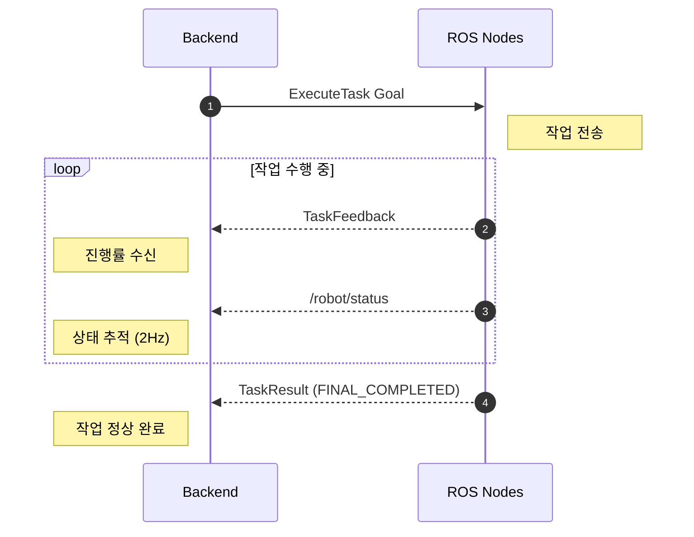
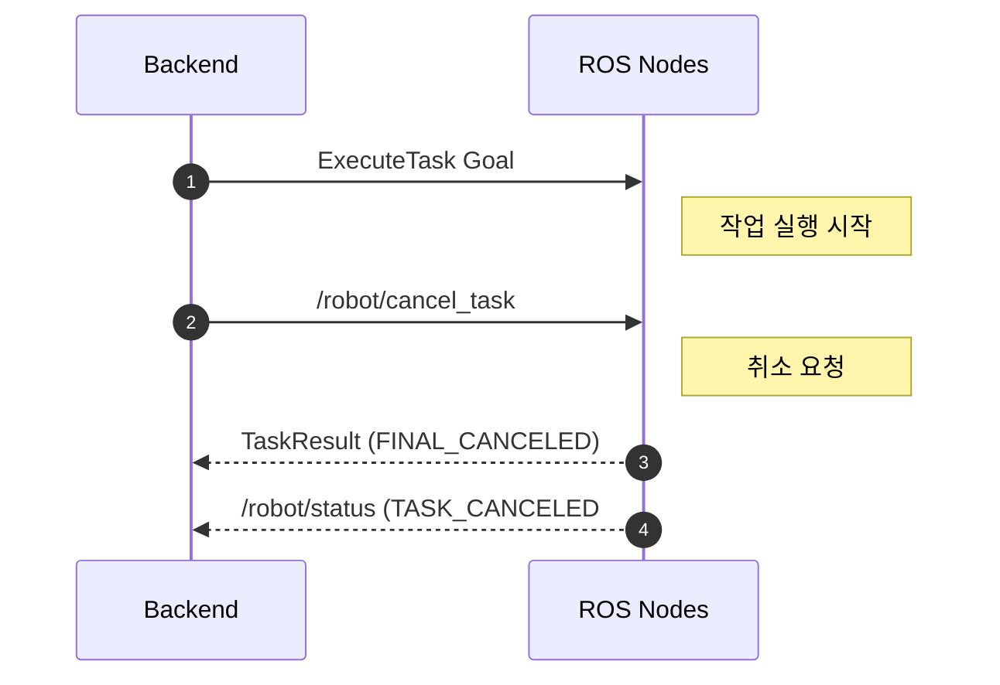
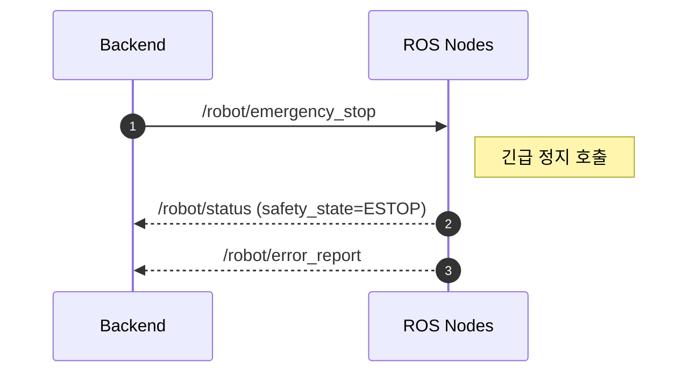

# 🤖 Robot Control API 문서 정리 (MVP v0.1.0)

---

## 📌 1. 시스템 개요

### 아키텍처

```
Web Dashboard ──→ Backend ──→ gRPC ──→ ROS Gateway ──→ ROS2 Nodes
```

### 기본 가정
| 항목 | 값 |
|------|------|
| 로봇 수 | 단일 로봇 (`robot_id = R1`) |
| 작업 수 | 단일 활성 작업 |
| Goal 수락 타임아웃 | **1초** |
| 작업 기본 타임아웃 | **300초** |
| 이동 실패 재시도 | **1회** |
| 최우선 명령 | **Emergency Stop** |

---

## 📡 2. 통신 인터페이스 전체 구조

> [!info] ROS2 Topic
> - `/robot/status` : 통합 상태 (2Hz)
> - `/robot/heartbeat` : 생존 확인 (1Hz)
> - `/robot/sensor_state` : 센서 데이터 (2Hz)
> - `/robot/error_report` : 오류 이벤트 (이벤트성)
> - `/robot/task_feedback` : 작업 피드백 (작업 중)
> - `/robot/module/state` : 모듈 상태 (변경 시)
> - `/robot/pose` : 위치/자세 (이동 중)

> [!tip] ROS2 Service
> - `/robot/emergency_stop` : 긴급 정지
> - `/robot/cancel_task` : 작업 취소
> - `/robot/manual_control` : 수동 제어
> - `/robot/module/set` : 모듈 on/off/세기 설정
> - `/robot/relocalize` : 위치추정 재정렬

> [!example] ROS2 Action
> - `/robot/execute_task` : 통합 작업 실행
> - `/robot/nav_to_goal` : 목표 지점 이동
> - `/robot/return_home` : 홈 복귀


---

## 📨 3. Topic 상세

### 3.1 `/robot/status` — 로봇 통합 상태 (2Hz)
> **메시지:** `robot_msgs/RobotStatus`

| 필드명               | 타입            | 설명                                                        |
| ----------------- | ------------- | --------------------------------------------------------- |
| `stamp`           | `Time`        | 상태 메시지 생성 시각                                              |
| `robot_id`        | `string`      | 로봇 식별자                                                    |
| `mode`            | `uint8`       | 현재 동작 모드 (`IDLE / MANUAL / AUTONOMOUS / DOCKING / ERROR`) |
| `task_state`      | `uint8`       | 현재 작업 상태 (`NONE / RECEIVED / VALIDATING / ...`)           |
| `active_task_id`  | `string`      | 현재 수행 중인 작업 ID                                            |
| `pose`            | `PoseStamped` | 현재 위치 및 자세                                                |
| `battery_pct`     | `float32`     | 배터리 잔량 (0~100)                                            |
| `is_charging`     | `bool`        | 충전 중 여부                                                   |
| `safety_state`    | `uint8`       | 안전 상태 (`NORMAL / WARN / ESTOP`)                           |
| `last_error_code` | `uint32`      | 마지막 오류 코드                                                 |

### 3.2 `/robot/heartbeat` — 생존/헬스 (1Hz)
> **메시지:** `robot_msgs/Heartbeat`

| 필드               | 타입     | 설명                                |
| ---------------- | ------ | --------------------------------- |
| `stamp`          | Time   | 심박 시각                             |
| `robot_id`       | string | 로봇 ID                             |
| `node_name`      | string | 노드 이름                             |
| `seq`            | uint32 | 시퀀스 번호                            |
| `health_state`   | uint8  | `ONLINE` / `DEGRADED` / `OFFLINE` |
| `active_task_id` | string | 활성 작업 ID                          |

### 3.3 `/robot/sensor_state` — 센서 데이터 (2Hz)
> **메시지:** `robot_msgs/SensorState`

| 필드 | 타입 | 설명 |
|------|------|------|
| `stamp` | Time | 측정 시각 |
| `source` | string | 센서 소스 ID |
| `temperature_c` | float32 | 온도 (℃) |
| `humidity_pct` | float32 | 습도 (%) |
| `pm25` | float32 | 미세먼지 |
| `obstacle_dist_m` | float32 | 장애물 거리 (m) |
| `localization_score` | float32 | 위치추정 신뢰도 (0~1) |
| `is_valid` | bool | 유효 데이터 여부 |

### 3.4 `/robot/error_report` — 오류 이벤트 (이벤트성)
> **메시지:** `robot_msgs/ErrorReport`

| 필드 | 타입 | 설명 |
|------|------|------|
| `stamp` | Time | 오류 시각 |
| `error_id` | string | 오류 이벤트 ID |
| `task_id` | string | 연관 작업 ID |
| `component` | string | 발생 컴포넌트 |
| `code` | uint32 | 오류 코드 |
| `severity` | uint8 | `INFO` / `WARN` / `ERROR` / `FATAL` |
| `message` | string | 오류 메시지 |
| `recoverable` | bool | 복구 가능 여부 |

### 3.5 `/robot/module/state` — 모듈 상태 (변경 시)
> **메시지:** `robot_msgs/ModuleState`

| 필드 | 타입 | 설명 |
|------|------|------|
| `module_type` | uint8 | 모듈 타입 |
| `is_available` | bool | 사용 가능 여부 |
| `is_on` | bool | 동작 여부 |
| `level` | uint8 | 세기 |
| `health` | uint8 | `OK` / `WARN` / `FAULT` |
| `reason` | string | 비정상 사유 |

### 3.6 `/robot/pose` — 위치/자세 (이동 중)
> **메시지:** `geometry_msgs/PoseStamped` (표준 ROS 메시지)

---

## 🔧 4. Service 상세

### 4.1 `/robot/emergency_stop` ⚠️ 최우선
> **타입:** `robot_msgs/srv/EmergencyStop`
> **흐름:** Backend/Gateway → Safety Node

```
[Request]                    [Response]
├─ reason     : string       ├─ accepted   : bool
└─ command_id : string       ├─ applied_at : Time
                             └─ message    : string
```

### 4.2 `/robot/cancel_task`
> **타입:** `robot_msgs/srv/CancelTask`
> **흐름:** Backend/Gateway → Task Executor

```
[Request]                    [Response]
├─ task_id    : string       ├─ accepted : bool
└─ command_id : string       ├─ state    : uint8
                             └─ message  : string
```

### 4.3 `/robot/manual_control`
> **타입:** `robot_msgs/srv/SetManualControl`
> **흐름:** Backend/Gateway → Task Executor

```
[Request]                    [Response]
├─ vx          : float64     ├─ accepted : bool
├─ wz          : float64     └─ message  : string
├─ duration_ms : uint32
└─ command_id  : string
```

### 4.4 `/robot/module/set`
> **타입:** `robot_msgs/srv/SetModuleState`
> **흐름:** Task Executor/Backend → Module Controller

```
[Request]                    [Response]
├─ module_type : uint8       ├─ accepted     : bool
├─ power_on    : bool        ├─ module_state : ModuleState
├─ level       : uint8       └─ message      : string
└─ command_id  : string
```

### 4.5 `/robot/relocalize`
> **타입:** `robot_msgs/srv/Relocalize`
> **흐름:** Backend/Gateway → Nav Adapter

```
[Request]                    [Response]
└─ strategy : uint8          ├─ success : bool
                             ├─ score   : float32
                             └─ message : string
```

---

## 🎯 5. Action 상세

### 5.1 `/robot/execute_task` — 핵심 통합 작업
> **타입:** `robot_msgs/action/ExecuteTask`
> **흐름:** Backend/Gateway → Task Executor

## `/robot/execute_task` Action
> [!example] Goal
> | 필드명 | 타입 | 설명 |
> |---|---|---|
> | `task_id` | `string` | 작업 식별자 |
> | `command_id` | `string` | 외부 명령 식별자 |
> | `task_type` | `uint8` | 작업 유형 |
> | `target_zone` | `string` | 목표 구역 이름 |
> | `target_pose` | `PoseStamped` | 목표 위치/자세 |
> | `module_type` | `uint8` | 제어 대상 모듈 유형 |
> | `module_power` | `bool` | 모듈 전원 상태 |
> | `module_level` | `uint8` | 모듈 세기/레벨 |
> | `max_exec_sec` | `uint32` | 최대 실행 허용 시간(초) |

> [!info] Feedback
> | 필드명 | 타입 | 설명 |
> |---|---|---|
> | `task_id` | `string` | 작업 식별자 |
> | `phase` | `string` | 현재 작업 단계 |
> | `progress_pct` | `float32` | 진행률 |
> | `current_pose` | `PoseStamped` | 현재 위치/자세 |
> | `eta_sec` | `float32` | 예상 남은 시간(초) |
> | `note` | `string` | 추가 메시지 |

> [!success] Result
> | 필드명 | 타입 | 설명 |
> |---|---|---|
> | `task_id` | `string` | 작업 식별자 |
> | `final_state` | `uint8` | 최종 상태 |
> | `result_code` | `uint32` | 결과 코드 |
> | `result_message` | `string` | 결과 메시지 |
> | `started_at` | `Time` | 시작 시각 |
> | `finished_at` | `Time` | 종료 시각 |
> | `error_code` | `uint32` | 오류 코드 |

**task_type 열거값:**

| 값   | 이름                      | 설명         |
| --- | ----------------------- | ---------- |
| 0   | `TASK_MOVE_AND_EXECUTE` | 이동 + 모듈 실행 |
| 1   | `TASK_MOVE_ONLY`        | 이동만        |
| 2   | `TASK_MODULE_ONLY`      | 모듈 실행만     |
| 3   | `TASK_RETURN_HOME`      | 홈 복귀       |

**final_state 열거값:**

| 값 | 이름 | 설명 |
|---|---|---|
| 0 | `FINAL_COMPLETED` | 정상 완료 |
| 1 | `FINAL_FAILED` | 실패 |
| 2 | `FINAL_CANCELED` | 취소됨 |
| 3 | `FINAL_REJECTED` | 거부됨 |

### 5.2 `/robot/nav_to_goal` — 목표 지점 이동
> **타입:** `robot_msgs/action/NavToGoal`
> **흐름:** Task Executor/Backend → Nav Adapter

> [!example] Goal
> | 필드명 | 타입 | 설명 |
> |---|---|---|
> | `task_id` | `string` | 작업 식별자 |
> | `command_id` | `string` | 외부 명령 식별자 |
> | `target_zone` | `string` | 목표 구역 이름 |
> | `target_pose` | `PoseStamped` | 목표 위치/자세 |
> | `timeout_sec` | `uint32` | 제한 시간(초) |

> [!info] Feedback
> | 필드명 | 타입 | 설명 |
> |---|---|---|
> | `task_id` | `string` | 작업 식별자 |
> | `progress_pct` | `float32` | 진행률 |
> | `current_pose` | `PoseStamped` | 현재 위치/자세 |
> | `eta_sec` | `float32` | 예상 남은 시간(초) |
> | `phase` | `string` | 현재 작업 단계 |

> [!success] Result
> | 필드명 | 타입 | 설명 |
> |---|---|---|
> | `task_id` | `string` | 작업 식별자 |
> | `success` | `bool` | 작업 성공 여부 |
> | `result_code` | `uint32` | 결과 코드 |
> | `message` | `string` | 결과 메시지 |

### 5.3 `/robot/return_home` — 홈 복귀
> **타입:** `robot_msgs/action/ReturnHome`
> **흐름:** Task Executor/Backend → Nav Adapter

> [!example] Goal
> | 필드명 | 타입 | 설명 |
> |---|---|---|
> | `task_id` | `string` | 작업 식별자 |
> | `command_id` | `string` | 외부 명령 식별자 |
> | `home_zone` | `string` | 복귀할 홈 구역 이름 |
> | `timeout_sec` | `uint32` | 제한 시간(초) |

> [!info] Feedback
> | 필드명 | 타입 | 설명 |
> |---|---|---|
> | `task_id` | `string` | 작업 식별자 |
> | `progress_pct` | `float32` | 진행률 |
> | `current_pose` | `PoseStamped` | 현재 위치/자세 |
> | `eta_sec` | `float32` | 예상 남은 시간(초) |
> | `phase` | `string` | 현재 작업 단계 |

> [!success] Result
> | 필드명 | 타입 | 설명 |
> |---|---|---|
> | `task_id` | `string` | 작업 식별자 |
> | `success` | `bool` | 작업 성공 여부 |
> | `result_code` | `uint32` | 결과 코드 |
> | `message` | `string` | 결과 메시지 |

---

## 🔄 6. 작업 상태 전이 (State Machine)

### 정상 흐름
```
IDLE
  │
  ▼
COMMAND_RECEIVED
  │
  ▼
VALIDATING
  │
  ▼
ACCEPTED
  │
  ▼
MOVING ──────────────────→ ARRIVED
                              │
                              ▼
                       EXECUTING_MODULE
                              │
                              ▼
                         (RETURNING)
                              │
                              ▼
                          COMPLETED ✅
```

### 예외 흐름
```
어떤 상태에서든:
  ├──→ CANCELED        (취소 요청 시)
  ├──→ FAILED          (실패 시)
  └──→ EMERGENCY_STOPPED ⚠️  (긴급정지 - 최우선)
```
### 통합
![[Mermaid Chart - Create complex, visual diagrams with text.-2026-03-18-051006.svg]]
---

## ❌ 7. 오류 코드 표

| 코드 | 이름 | 설명 | 심각도 |
|------|------|------|--------|
| **0** | `OK` | 정상 | - |
| **1001** | `VALIDATION_FAILED` | 명령 검증 실패 | ERROR |
| **2001** | `NAVIGATION_FAILED` | 이동/복귀 실패 | ERROR |
| **3001** | `MODULE_FAILED` | 모듈 제어 실패 | ERROR |
| **4001** | `CANCELED` | 작업 취소 | INFO |
| **5001** | `EMERGENCY_STOP` | 긴급 정지 | FATAL |
| **5002** | `LOW_BATTERY` | 저전력 이벤트 | WARN |
| **6001** | `LOCALIZATION_LOST` | 위치추정 신뢰도 하락 | ERROR |

---

## 📋 8. 표준 시나리오 플로우

### 시나리오 1: 정상 실행 ✅



### 시나리오 2: 작업 취소 🚫



### 시나리오 3: 긴급 정지 ⚠️


---

## 💻 9. 빠른 테스트 CLI 명령어

```bash
# 🟢 작업 실행 (이동 + 모듈)
ros2 action send_goal /robot/execute_task robot_msgs/action/ExecuteTask \
  "{task_id: 'task-1', command_id: 'cmd-1', task_type: 0, \
    target_zone: 'living_room', module_type: 1, module_power: true, \
    module_level: 2, max_exec_sec: 120}"

# 🔴 긴급 정지
ros2 service call /robot/emergency_stop robot_msgs/srv/EmergencyStop \
  "{reason: 'manual_emergency', command_id: 'cmd-estop-1'}"

# 🟡 작업 취소
ros2 service call /robot/cancel_task robot_msgs/srv/CancelTask \
  "{task_id: 'task-1', command_id: 'cmd-cancel-1'}"

# 🔵 수동 제어 (전진 0.2m/s, 1.5초)
ros2 service call /robot/manual_control robot_msgs/srv/SetManualControl \
  "{vx: 0.2, wz: 0.0, duration_ms: 1500, command_id: 'cmd-manual-1'}"

# 📊 상태 모니터링
ros2 topic echo /robot/status
ros2 topic echo /robot/heartbeat
ros2 topic echo /robot/error_report
```

---

## 🗺️ 10. 한눈에 보는 노드 간 통신 맵
![[Mermaid Chart - Create complex, visual diagrams with text.-2026-03-18-051516.svg]]
> [!info] Topic 발행 방향
> - `Safety / TaskExecutor / NavAdapter → Gateway → Backend`
> - `/robot/status` : 통합 상태
> - `/robot/heartbeat` : 생존 확인
> - `/robot/sensor_state` : 센서 데이터
> - `/robot/error_report` : 오류 이벤트
> - `/robot/task_feedback` : 작업 피드백
> - `/robot/module/state` : 모듈 상태
> - `/robot/pose` : 위치/자세

---

> **버전:** v0.1.0 (MVP 초안) | 단일 로봇(R1), 단일 작업 기준

---

## gRPC 게이트웨이 연동 문서
- 상세 RPC 문서: `docs/grpc_gateway_api.md`
- 한글 문서: `docs/grpc_gateway_api.ko.md`
