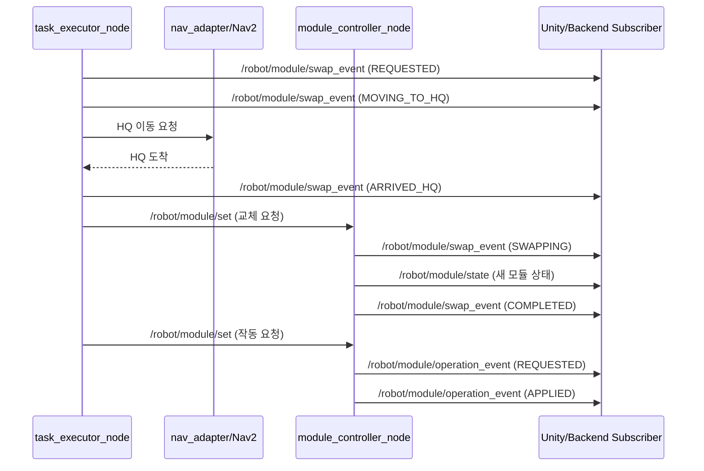

# 모듈 토픽 중심 운영 문서

## 1. 목적과 범위
- 이 문서는 ROS2에서 **모듈 상태/교체/작동**과 관련된 토픽을 기준으로 동작을 정의합니다.
- 외부 API(gRPC)는 유지하고, ROS 내부에서 Unity/Backend가 구독해야 할 토픽 계약을 명확히 합니다.
- 기준 코드: `robot_core/module_controller_node.py`, `robot_core/task_executor_node.py`, `robot_msgs/msg/*`.

## 2. 모듈 관련 인터페이스 요약

| 이름 | 타입 | 메시지/서비스 타입 | 주요 발행/서버 | 주요 구독/클라이언트 | 성격 |
|---|---|---|---|---|---|
| `/robot/module/state` | Topic | `robot_msgs/ModuleState` | `module_controller_node` | `task_executor_node`, Unity, Backend | 현재 모듈 스냅샷(초기 1회 + 주기) |
| `/robot/module/swap_event` | Topic | `robot_msgs/ModuleSwapEvent` | `task_executor_node`, `module_controller_node` | Unity, Backend, 운영 로깅 | 교체 라이프사이클 이벤트 |
| `/robot/module/operation_event` | Topic | `robot_msgs/ModuleOperationEvent` | `module_controller_node` | Unity, Backend, 운영 로깅 | 작동(on/off/level) 적용 이벤트 |
| `/robot/module/set` | Service | `robot_msgs/srv/SetModuleState` | `module_controller_node` | `task_executor_node`(내부), 필요 시 운영 툴 | 모듈 상태 변경 요청 |

## 3. Topic 상세

### 3.1 `/robot/module/state` (`robot_msgs/ModuleState`)

| 필드 | 타입 | 의미 |
|---|---|---|
| `module_type` | `uint8` | 현재 장착 모듈 타입 |
| `is_available` | `bool` | 모듈 사용 가능 여부 |
| `is_on` | `bool` | 작동 중 여부 |
| `level` | `uint8` | 작동 레벨(0~3) |
| `health` | `uint8` | 모듈 헬스 |
| `reason` | `string` | 비정상/불가 사유 |

`module_type` enum:

| 이름 | 값 |
|---|---|
| `MODULE_NONE` | `0` |
| `MODULE_AIR_PURIFIER` | `1` |
| `MODULE_HUMIDIFIER` | `2` |
| `MODULE_DEHUMIDIFIER` | `3` |

`health` enum:

| 이름 | 값 |
|---|---|
| `HEALTH_OK` | `0` |
| `HEALTH_WARN` | `1` |
| `HEALTH_FAULT` | `2` |

발행 정책:
- 노드 시작 직후 1회 즉시 발행
- `state_publish_rate_hz`(기본 1Hz) 주기 발행
- `/robot/module/set` 성공 시 즉시 최신 상태 반영

### 3.2 `/robot/module/swap_event` (`robot_msgs/ModuleSwapEvent`)

필드:

| 필드 | 타입 | 의미 |
|---|---|---|
| `stamp` | `builtin_interfaces/Time` | 이벤트 발생 시각 |
| `task_id` | `string` | 연관 작업 ID |
| `command_id` | `string` | 연관 명령 ID |
| `from_module_type` | `uint8` | 교체 전 모듈 |
| `to_module_type` | `uint8` | 교체 후 모듈 |
| `state` | `uint8` | 교체 단계 |
| `success` | `bool` | 단계 성공 여부 |
| `message` | `string` | 사람이 읽는 설명 |

`state` enum:

| 이름 | 값 | 주 사용 발행자 | 의미 |
|---|---|---|---|
| `STATE_REQUESTED` | `0` | `task_executor_node` | 불일치 감지, 교체 필요 판정 |
| `STATE_MOVING_TO_HQ` | `1` | `task_executor_node` | HQ 이동 시작 |
| `STATE_ARRIVED_HQ` | `2` | `task_executor_node` | HQ 도착 |
| `STATE_SWAPPING` | `3` | `module_controller_node` | 실제 교체 적용 중 |
| `STATE_COMPLETED` | `4` | `module_controller_node` | 교체 완료 |
| `STATE_FAILED` | `5` | 둘 다 | 교체/준비/이동 실패 |

중요:
- 이 토픽은 **발행자가 2개**입니다.
- 소비자는 `task_id`, `command_id`, `state`를 함께 보고 단계 전이를 처리해야 합니다.

### 3.3 `/robot/module/operation_event` (`robot_msgs/ModuleOperationEvent`)

필드:

| 필드 | 타입 | 의미 |
|---|---|---|
| `stamp` | `builtin_interfaces/Time` | 이벤트 시각 |
| `task_id` | `string` | 연관 작업 ID |
| `command_id` | `string` | 연관 명령 ID |
| `module_type` | `uint8` | 대상 모듈 타입 |
| `power_on` | `bool` | 전원 요청값 |
| `level` | `uint8` | 레벨 요청값 |
| `state` | `uint8` | 적용 단계 |
| `success` | `bool` | 적용 성공 여부 |
| `message` | `string` | 상세 메시지 |

`state` enum:

| 이름 | 값 | 의미 |
|---|---|---|
| `STATE_REQUESTED` | `0` | 작동 적용 시작 |
| `STATE_APPLIED` | `1` | 적용 성공 |
| `STATE_FAILED` | `2` | 적용 실패 |

## 4. HQ 선교체 + 작업 실행 시 토픽 흐름

조건: `MOVE_AND_EXECUTE` 또는 `MODULE_ONLY`에서 요청 모듈과 현재 장착 모듈이 다름.



## 5. Unity 연동 권장 규칙

- 모델 교체:
  - `/robot/module/swap_event`에서 `STATE_COMPLETED && success=true` 수신 시 모델 변경.
  - 보정용으로 `/robot/module/state`를 기준 상태로 주기 동기화.
- 환경 효과(파티클/바람/가습 등):
  - `/robot/module/operation_event`에서 `STATE_APPLIED`를 트리거로 반영.
  - `power_on=false` 또는 `level=0`이면 효과 중지.
- 이벤트 유실 대비:
  - 이벤트 토픽만 신뢰하지 말고 `/robot/module/state`를 최종 상태 소스로 사용.

## 6. 확인/테스트 명령어

컨테이너 환경 기준:

```bash
docker compose exec ros2-run bash -lc "source /workspace/ros2_ws/install/setup.bash && ros2 topic info /robot/module/state -v"
docker compose exec ros2-run bash -lc "source /workspace/ros2_ws/install/setup.bash && ros2 topic echo /robot/module/state"
docker compose exec ros2-run bash -lc "source /workspace/ros2_ws/install/setup.bash && ros2 topic echo /robot/module/swap_event"
docker compose exec ros2-run bash -lc "source /workspace/ros2_ws/install/setup.bash && ros2 topic echo /robot/module/operation_event"
```

수동 서비스 호출 예시:

```bash
docker compose exec ros2-run bash -lc "source /workspace/ros2_ws/install/setup.bash && ros2 service call /robot/module/set robot_msgs/srv/SetModuleState \"{module_type: 1, power_on: true, level: 2, task_id: 'manual-test', command_id: 'manual-test'}\""
```

## 7. 트러블슈팅

### 7.1 이벤트는 오는데 상태가 안 맞는 경우
- `/robot/module/state`를 최종 진실 소스로 사용했는지 확인
- `swap_event` 발행자가 2개이므로 `state` 순서만 보고 단정하지 않았는지 확인

### 7.2 `MODULE_STATE_UNAVAILABLE` 발생
- `module_controller_node` 실행 여부 확인
- `/robot/module/state` 수신 여부 확인 (`ros2 topic echo`)

### 7.3 교체 후 Unity 모델이 안 바뀌는 경우
- Unity가 `/robot/module/swap_event`를 구독 중인지 확인
- `STATE_COMPLETED` 이벤트를 처리하도록 Unity 로직이 구현됐는지 확인
- 보정 로직으로 `/robot/module/state` 주기 동기화를 함께 사용했는지 확인

