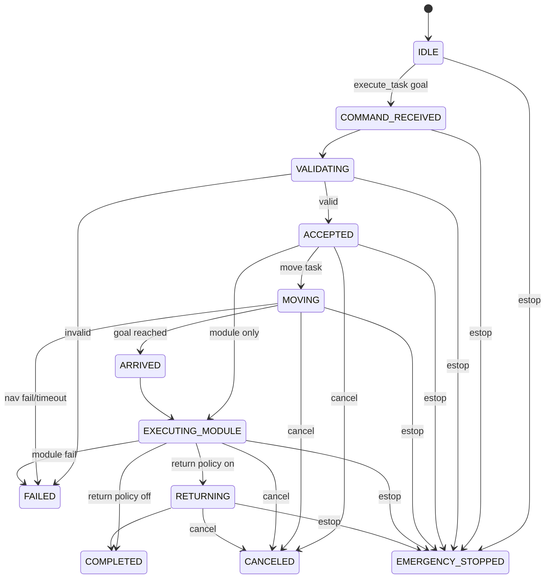

# 작업 상태 머신

## 재시도/취소 규칙
- 이동 재시도: 자동 1회(정책 문서 기준), 현재 구현은 자동 재시도 미적용.
- 모듈 재시도: 복구 가능 실패 시 1회(정책 문서 기준), 현재 구현은 재시도 미적용.
- 취소 허용 상태: `ACCEPTED`, `MOVING`, `EXECUTING_MODULE`, `RETURNING`.
- E-stop은 최우선이며 모든 상태를 선점한다.
