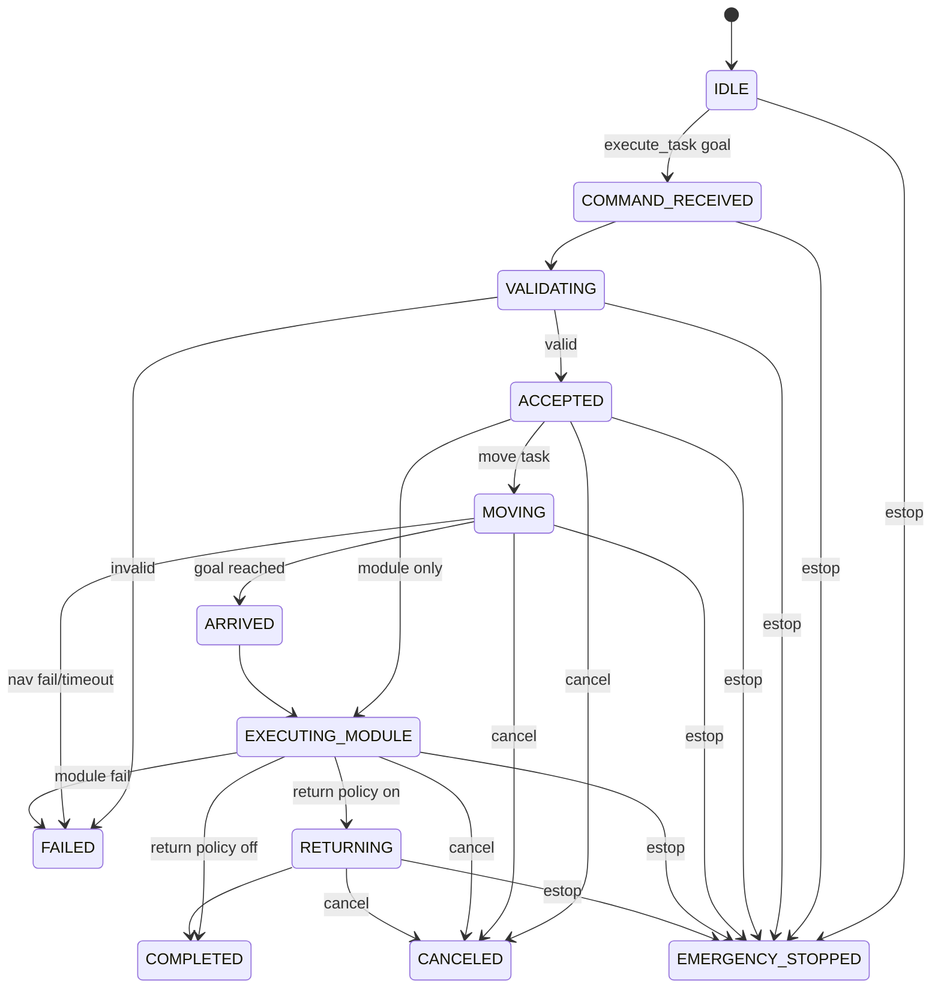

# Task State Machine

## Retry/Cancellation Rules
- Navigation retry: 1 automatic retry (policy document), current implementation: no automatic retry yet.
- Module retry: recoverable failure 1 retry (policy document), current implementation: no retry yet.
- Cancellation allowed during `ACCEPTED`, `MOVING`, `EXECUTING_MODULE`, `RETURNING`.
- E-stop has highest priority and preempts all states.
